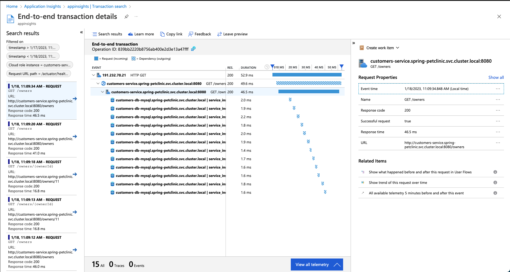

## About this project

As we move to microservices based architectures, having a comprehensive observability solution is key to have highly available and reliable applications. Aside from compute resources and network metrics, it's vital to also understand how your application behaves.

Application Insights is an extension of Azure Monitor that provides a way to look into your applicaton to understand how it performs and helps you to determine the cause of an incident or application errors.

This repository deploys an AKS cluster running a springboot demo application, [Petclinic](https://github.com/spring-petclinic/spring-petclinic-cloud), and configures Application Insights in its microservices using [auto-instrumentation](https://learn.microsoft.com/en-us/azure/azure-monitor/app/java-in-process-agent) so you can take a look into the Application Insights features without having to change your application and environment.



### Create the infrastructure using terraform

Since some of this lab's resources requires [kubernetes API access during planning time](https://registry.terraform.io/providers/hashicorp/kubernetes/latest/docs/resources/manifest#before-you-use-this-resource), we need to create our AKS cluster first.

```
$ cd terraform
$ az login
$ terraform init
$ terraform plan -var 'aks-petclinic-rg=<resource_group_name>' -target azurerm_kubernetes_cluster.aks-petclinic
$ terraform apply -var 'aks-petclinic-rg=<resource_group_name>' -target azurerm_kubernetes_cluster.aks-petclinic
```

We can now create the remaining of the resources.

```
$ terraform plan -var 'aks-petclinic-rg=<resource_group_name>'
$ terraform apply -var 'aks-petclinic-rg=<resource_group_name>'
$ az aks get-credentials --resource-group <resource_group_name> --name aks-petclinic
```

Get the application ip address.

```
$ kubectl -n spring-petclinic get svc api-gateway \
-o jsonpath='{.status.loadBalancer.ingress[0].ip}'
```

You can navigate through the application to generate some traffic into our Application Insights workspace.

After that make sure to check Application Insights on Azure Portal.

Reference:

https://github.com/spring-petclinic/spring-petclinic-cloud

https://learn.microsoft.com/en-us/azure/azure-monitor/app/app-insights-overview

https://learn.microsoft.com/en-us/azure/azure-monitor/app/java-in-process-agent